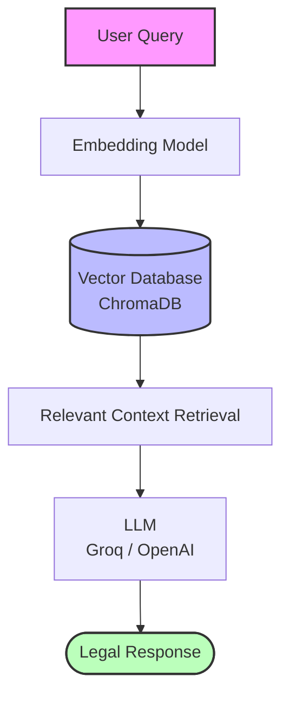

```markdown
# ⚖️ Legal Navi
### AI-Powered Indian Legal Assistant using RAG & LLMs

---

## 📌 Overview

**Legal Navi** is an AI-powered legal intelligence platform designed to simplify Indian legal understanding through **Large Language Models (LLMs)** and **Retrieval-Augmented Generation (RAG)**.

The system analyzes user queries or legal incidents and provides:
- ⚖️ **Relevant legal sections**
- 📚 **Context-aware legal explanations**
- 🧠 **AI-generated legal insights**
- 🔍 **Retrieval-based accurate responses**
- 🛡️ **Reduced hallucination** using RAG pipelines

The project aims to bridge the gap between complex legal systems and ordinary citizens by making legal assistance more accessible, faster, and easier to understand.

---

## ✨ Key Features

* **🧠 AI-Powered Legal Assistance:** Understand legal queries in natural language and generate contextual legal responses.
* **📚 Retrieval-Augmented Generation (RAG):** Uses vector databases and semantic retrieval to provide grounded legal answers instead of purely generative responses.
* **⚖️ Indian Law Focused:** Built specifically for Indian legal systems and workflows.
* **🔍 Intelligent Legal Search:** Search across legal documents, sections, and contextual references.
* **🛡️ Hallucination Reduction:** Combines retrieval systems with LLMs to improve factual reliability.
* **💬 Conversational Interface:** Simple chat-style interaction for users with no legal background.
* **🚀 Scalable Architecture:** Designed for future expansion into multilingual and advanced legal research capabilities.

---

## 🏗️ System Architecture



---

## 🛠️ Tech Stack

| Technology | Purpose |
| --- | --- |
| **Python** | Core backend logic |
| **Streamlit** | Frontend User Interface |
| **LangChain** | LLM orchestration and chaining |
| **ChromaDB** | Vector database for document embeddings |
| **Groq API** | High-speed LLM inference |
| **OpenAI API** | Advanced language model support |
| **HuggingFace** | Open-source Embeddings / NLP |

---

## 📂 Project Structure

```text
LegalNavi/
│
├── app.py                  # Main Streamlit application
├── requirements.txt        # Python dependencies
├── chroma_db/              # Local vector database storage
├── data/                   # Raw legal documents and PDFs
├── embeddings/             # Embedding generation logic
├── utils/                  # Helper functions and configurations
├── prompts/                # System prompt templates
├── assets/                 # Images and UI assets
└── README.md               # Project documentation

```

---

## ⚡ Installation & Setup

### 1️⃣ Clone the Repository

```bash
git clone [https://github.com/raznam/legalnavi.git](https://github.com/raznam/legalnavi.git)
cd legalnavi

```

### 2️⃣ Create a Virtual Environment

**For Windows:**

```bash
python -m venv venv
venv\Scripts\activate

```

**For Linux / Mac:**

```bash
python3 -m venv venv
source venv/bin/activate

```

### 3️⃣ Install Dependencies

```bash
pip install -r requirements.txt

```

### 4️⃣ Configure Environment Variables

Create a `.env` file in the root directory and add your API keys:

```env
OPENAI_API_KEY=your_openai_api_key_here
GROQ_API_KEY=your_groq_api_key_here

```

### 5️⃣ Run the Application

```bash
streamlit run app.py

```

---

## 📸 Screenshots

### 🏠 Home Interface

### 💬 Legal Chat Assistant

### 📚 Retrieved Legal Context

---

## 🔍 Example Queries

Try asking the assistant:

* *"What legal action can be taken for online fraud in India?"*
* *"Explain IPC sections related to theft."*
* *"What are the rights of women under Indian law?"*
* *"What are the immediate legal steps I should take after a road accident?"*
* *"Explain the cybercrime complaint process in India."*

---

## 🎯 Future Enhancements

* [ ] 🌐 **Multilingual legal support** (Hindi, Bengali, Tamil, etc.)
* [ ] 📄 **FIR drafting assistance**
* [ ] 🧾 **Automated legal document generation**
* [ ] 🎙️ **Voice-enabled legal assistant**
* [ ] 📱 **Dedicated Mobile application**
* [ ] 🏛️ **Court judgment summarization**

---

## 🤝 Contribution Guidelines

Contributions are always welcome! Here is how you can help:

1. **Fork** the repository.
2. **Create a new branch** (`git checkout -b feature/AmazingFeature`).
3. **Commit your changes** (`git commit -m 'Add some AmazingFeature'`).
4. **Push to the branch** (`git push origin feature/AmazingFeature`).
5. **Open a Pull Request**.

---

## 🛡️ Disclaimer

**Legal Navi** is an AI-assisted informational platform. The responses generated by this system should **not** be considered a substitute for professional legal advice, counsel, or representation from certified legal practitioners. Always consult a qualified lawyer for official legal matters.

---

## 👨‍💻 Authors

**Team Legal Navi**

*Built with the vision of democratizing legal accessibility through Artificial Intelligence.*

---

## 🌟 Support the Project

If you found this project useful, please consider supporting it!

* ⭐ **Star** the repository
* 🍴 **Fork** the project
* 📢 **Share** it with others in the tech and legal communities

---
